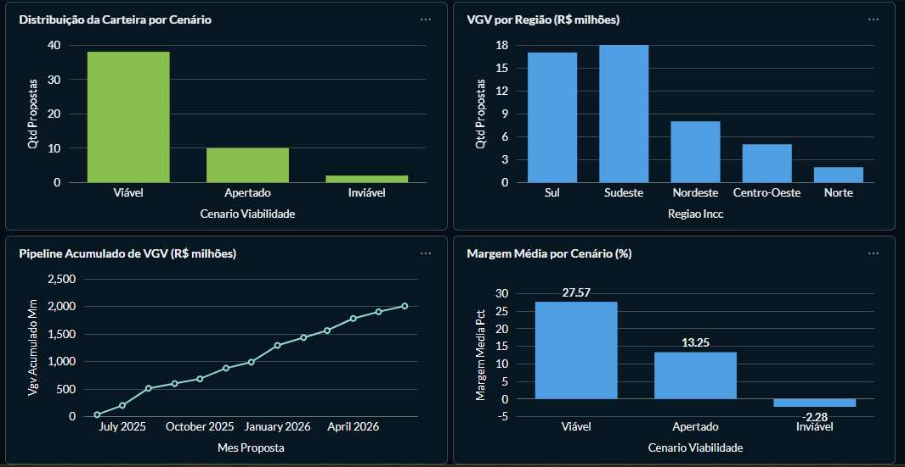

# Pipeline de Risco de Credito Imobiliario

Projeto de portfólio de Engenharia e Análise de Dados simulando a stack analítica de uma
fintech de crédito estruturado ou PropTech brasileira.

O pipeline coleta indicadores macroeconômicos públicos (BACEN/SGS), gera uma base sintética
de propostas de empreendimentos imobiliários com coerência financeira garantida, processa
tudo em DuckDB, e expõe os dados via PostgreSQL para um dashboard executivo no Metabase.

---

## Dashboard



O dashboard executivo no Metabase consolida quatro visões da carteira:

- **Distribuição da Carteira por Cenário** — funil de saúde (Viável / Apertado / Inviável)
- **VGV por Região** — concentração regional de risco (chave `regiao_incc`)
- **Pipeline Acumulado de VGV** — evolução da originação ao longo do tempo
- **Margem Média por Cenário** — sinal de viabilidade; o cenário Inviável apresenta margem média negativa

---

## Contexto de Negócio

Uma fintech de crédito imobiliário precisa avaliar a viabilidade de empreendimentos antes de
liberar crédito para construtoras. O motor de crédito precisa responder perguntas como:

- O VGV cobre todos os custos? A margem é suficiente para absorver imprevistos de obra?
- O LTV pretendido está dentro do limite prudencial (80% do custo de construção)?
- Como o cenário de Selic e IPCA afeta a rentabilidade do empreendimento ao longo da obra?
- Existe concentração regional de risco na carteira?

Este projeto constrói a base de dados que alimenta essas respostas.

---
> **Janela de referência:** este projeto trabalha com um recorte histórico fixo
> (jan/2023 a dez/2024). As séries do BACEN são coletadas nesse intervalo e a
> base de empreendimentos é sintética com `seed` fixo, garantindo
> reprodutibilidade. Não é um pipeline em tempo real — é um snapshot analítico
> versionado. A coleta contínua está prevista nas próximas etapas.
---

## Arquitetura

```
Fontes Públicas              Dados Sintéticos
API BACEN SGS                Mock Generator
      |                            |
      v                            v
 data/raw/                    data/raw/
 bacen_sgs_*.parquet       empreendimentos.parquet
      |                            |
      +------------+---------------+
                   |
                   v
         data/warehouse/credit_risk.duckdb
         ┌──────────────────────────────────────┐
         │ RAW                                  │
         │   raw_bacen_series                   │
         │                                      │
         │ PROCESSED                            │
         │   processed_bacen_series             │
         │   processed_empreendimentos          │
         │                                      │
         │ ANALYTICS                            │
         │   analytics_macro_indicators         │
         │   analytics_carteira_cenario         │
         │   analytics_carteira_regiao          │
         │   analytics_carteira_padrao          │
         │   analytics_pipeline_mensal          │
         └──────────────────────────────────────┘
                   |
                   v
         PostgreSQL (Docker)
         database: credit_risk
                   |
                   v
         Metabase  →  http://localhost:3000
```

---

## Stack Tecnológica

| Camada | Tecnologia | Função |
|---|---|---|
| Linguagem | Python 3.13 | Orquestração e processamento |
| Warehouse | DuckDB 1.1 | Banco analítico local (SQL sobre Parquet) |
| Serialização | Parquet + PyArrow | Formato colunar comprimido entre etapas |
| Extração | Requests | Coleta da API SGS/BACEN |
| Manipulação | Pandas 2.2 | DataFrames e exportação |
| Exportação | SQLAlchemy + psycopg2 | DuckDB → PostgreSQL |
| Banco relacional | PostgreSQL 16 | Camada de serving para o Metabase |
| Dashboard | Metabase | BI executivo (via Docker) |
| Infraestrutura | Docker Compose | Orquestração de containers |
| Testes | Pytest | Validações automatizadas |
| Config | python-dotenv | Variáveis de ambiente |

---

## Estrutura do Projeto

```
projeto-risco-credito-construcao/
│
├── data/
│   ├── raw/            # dados brutos (gitignored)
│   ├── processed/      # parquets padronizados e analíticos (gitignored)
│   └── warehouse/      # credit_risk.duckdb (gitignored)
│
├── docker/
│   └── initdb/
│       └── 01_create_databases.sql   # cria metabase_internal no primeiro boot
│
├── logs/               # logs de execução por camada (gitignored)
│
├── src/
│   ├── config/
│   │   └── series_config.py          # configuração das séries BACEN
│   ├── ingestion/
│   │   ├── fetch_bacen_sgs.py        # coleta API SGS/BACEN
│   │   └── generate_mock_deals.py    # gerador de propostas sintéticas
│   ├── processing/
│   │   ├── process_bacen_sgs.py      # processa séries macroeconômicas
│   │   └── process_empreendimentos.py # tipagem + KPIs derivados de crédito
│   ├── analytics/
│   │   ├── build_macro_indicators.py  # Selic acumulada, juro real
│   │   └── build_portfolio_analytics.py # 4 visões analíticas da carteira
│   ├── quality/
│   │   └── validate_bacen_series.py  # 8 validações automáticas de qualidade
│   └── export/
│       └── export_to_postgres.py     # DuckDB → PostgreSQL para o Metabase
│
├── tests/
│   ├── test_series_config.py
│   ├── test_process_bacen_sgs.py
│   └── test_quality_validations.py
│
├── docker-compose.yml
├── .env.docker          # template de credenciais (copiar para .env)
├── requirements.txt
└── README.md
```

---

## Fontes de Dados

### API SGS — Banco Central do Brasil

Janela de coleta: **01/01/2023 a 31/12/2024** (definida em `src/config/series_config.py`).

| Código SGS | Nome          | Frequência | Descrição                          |
| ---------- | ------------- | ---------- | ---------------------------------- |
| 11         | selic_diaria  | Diária     | Taxa Selic (capitalizada p/ mês)   |
| 433        | ipca_mensal   | Mensal     | IPCA — variação mensal             |
| 192        | incc_mensal   | Mensal     | INCC-DI (FGV) — variação mensal    |

> **Nota sobre o INCC:** a série 192 (INCC-DI nacional) é ingerida e processada,
> mas ainda **não** integra a tabela `analytics_macro_indicators` (que hoje cobre
> Selic, IPCA e juro real). Ela está disponível no warehouse para o cruzamento
> com o INCC regionalizado e a chave `regiao_incc` da carteira, planejado nas
> próximas etapas.

### Propostas Sintéticas de Empreendimentos

50 propostas geradas com coerência financeira garantida pela identidade:

```
VGV = custo_terreno + custo_construcao + outras_despesas + imposto_estimado + margem_inicial
```

Distribuição intencional de cenários (seed fixo para reprodutibilidade):

| Cenário | % Carteira | construction_pct / VGV | Margem esperada |
|---|---|---|---|
| Viável | ~70% | 40–50% | 15–28% do VGV |
| Apertado | ~20% | 55–65% | 1–14% do VGV |
| Inviável | ~10% | 75–90% | negativa |

---

## Tabelas no DuckDB

### Camada Processed

**`processed_bacen_series`** — séries macroeconômicas tipadas e unificadas

**`processed_empreendimentos`** — propostas com 5 KPIs de crédito derivados:

| KPI | Cálculo | Leitura |
|---|---|---|
| `custo_total` | soma de todos os custos | envelope total da operação |
| `prazo_obra_meses` | datediff(inicio, conclusao) | risco de duration |
| `margem_pct_vgv` | margem / VGV | principal sinal de viabilidade |
| `indice_cobertura` | VGV / custo_total | deve ser > 1.0 para projeto viável |
| `ltv_sobre_custo_construcao` | financiamento / custo_construcao | exposição do banco |

### Camada Analytics

> As contagens de linhas abaixo refletem a configuração de referência
> (janela 2023–2024, 50 propostas, `seed=42`). Como as agregações dependem
> dos dados gerados, os totais podem variar se o `seed`, o volume de propostas
> ou a janela de datas forem alterados.

| Tabela                       | Linhas (config. ref.) | Uso no Dashboard                         |
| ---------------------------- | --------------------- | ---------------------------------------- |
| `analytics_macro_indicators` | ~24 (meses 2023–2024) | evolução de Selic, IPCA e juro real      |
| `analytics_carteira_cenario` | ≤ 3 (por cenário)     | funil de saúde da carteira               |
| `analytics_carteira_regiao`  | ≤ 5 (por região)      | concentração regional de risco           |
| `analytics_carteira_padrao`  | ≤ 9 (padrão × cenário)| matriz padrão × cenário (scorecard)      |
| `analytics_pipeline_mensal`  | ~12–14 (por mês)      | pipeline de originação com VGV acumulado |
---

## Como Executar

### 1. Configurar o ambiente Python

```bash
python -m venv .venv
.\.venv\Scripts\Activate.ps1
pip install -r requirements.txt
```

### 2. Pipeline de dados (BACEN)

```bash
python -m src.ingestion.fetch_bacen_sgs
python -m src.processing.process_bacen_sgs
python -m src.analytics.build_macro_indicators
```

### 3. Pipeline de dados (Empreendimentos)

```bash
python -m src.ingestion.generate_mock_deals
python -m src.processing.process_empreendimentos
python -m src.analytics.build_portfolio_analytics
```

### 4. Validação de qualidade

```bash
python -m src.quality.validate_bacen_series
python -m pytest -v
```

### 5. Subir o ambiente Docker (Metabase + PostgreSQL)

```bash
# Copiar template e configurar credenciais
cp .env.docker .env
# editar .env: trocar 'changeme_strong_password' por uma senha real

# Subir os containers
docker compose up -d

# Verificar status
docker compose ps
```

### 6. Exportar dados do DuckDB para o PostgreSQL

```bash
python -m src.export.export_to_postgres
```

### 7. Configurar o Metabase

1. Acesse `http://localhost:3000`
2. Siga o wizard de primeiro acesso
3. Em **Admin → Databases → Add database → PostgreSQL**:
   - Host: `postgres`
   - Port: `5432`
   - Database: `credit_risk`
   - User/Password: valores do seu `.env`
4. As tabelas aparecem automaticamente para criar perguntas e dashboards

---

## Qualidade de Dados

O pipeline possui duas camadas de validação:

**Validações automáticas** (`src/quality/validate_bacen_series.py`):

- Tabelas obrigatórias existem no DuckDB
- Nenhuma tabela processada está vazia
- Sem valores nulos em colunas críticas
- Sem duplicatas por data e série
- Todas as séries configuradas presentes
- Datas dentro do período esperado
- Tabela analítica não vazia
- Sem meses duplicados na tabela analítica

**Gate de identidade financeira** (`process_empreendimentos.py`):

A `margem_inicial` é gerada como resíduo da identidade
(`VGV − custos`), de modo que a relação abaixo é verdadeira por construção.
O gate funciona, portanto, como **proteção contra corrupção dos dados**
(ex.: edição manual do Parquet, falha de serialização) e não como validação
estatística do gerador. O processamento falha com `ValueError` se qualquer
linha violar:

```
ABS((custo_total + margem_inicial) - VGV) > R$ 0.10
```

---

## Variáveis de Ambiente

Copie `.env.docker` para `.env` e preencha:

| Variável | Descrição |
|---|---|
| `POSTGRES_USER` | usuário do PostgreSQL |
| `POSTGRES_PASSWORD` | senha do PostgreSQL |
| `POSTGRES_DB` | banco de dados analítico (`credit_risk`) |
| `POSTGRES_PORT` | porta exposta no host (padrão: `5432`) |
| `POSTGRES_HOST` | host para conexão Python (`localhost`) |
| `METABASE_DB` | banco interno do Metabase (`metabase_internal`) |

O arquivo `.env` está no `.gitignore` — nunca commitar credenciais.

---

## Status Atual

Pipeline de dados **ponta a ponta**, da coleta ao dashboard:

- Pipeline BACEN: ingestão, processamento e analytics de Selic e IPCA
  (INCC ingerido, ainda fora da camada analítica)
- Pipeline Empreendimentos: 50 propostas sintéticas com 5 KPIs de crédito derivados
- Warehouse DuckDB com 9 tabelas organizadas em raw / processed / analytics
- Infraestrutura Docker Compose com PostgreSQL 16 e Metabase
- Exportação DuckDB → PostgreSQL
- Validações de qualidade + testes automatizados com pytest
- **Dashboard executivo no Metabase** com 4 visões da carteira: distribuição por
  cenário, VGV por região, pipeline acumulado de VGV e margem média por cenário
  (ver print na seção [Dashboard](#dashboard))

## Próximas Etapas

Evolução para **modelagem, dados reais e automação**:

- Modelo de scoring de risco de crédito baseado nos KPIs derivados
- Inclusão do INCC na camada analítica + cruzamento com INCC regionalizado (FGV)
- Integração de custos reais de construção (SINAPI/IBGE) para substituir a base sintética
- Novas visões no dashboard: matriz padrão × cenário (scorecard) e indicadores macro
